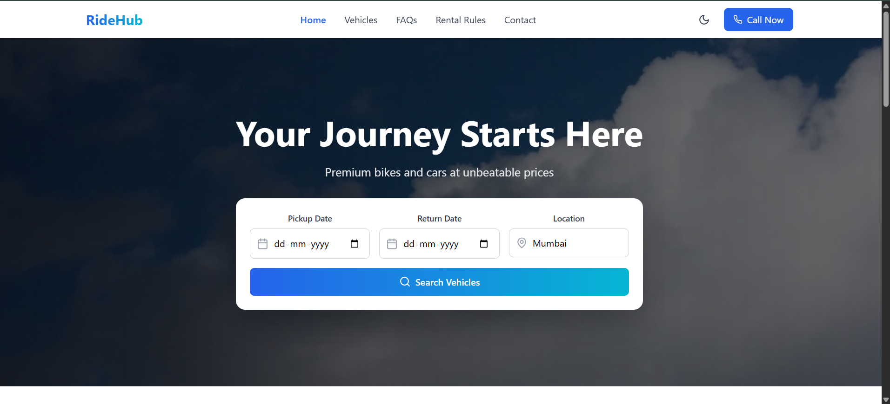
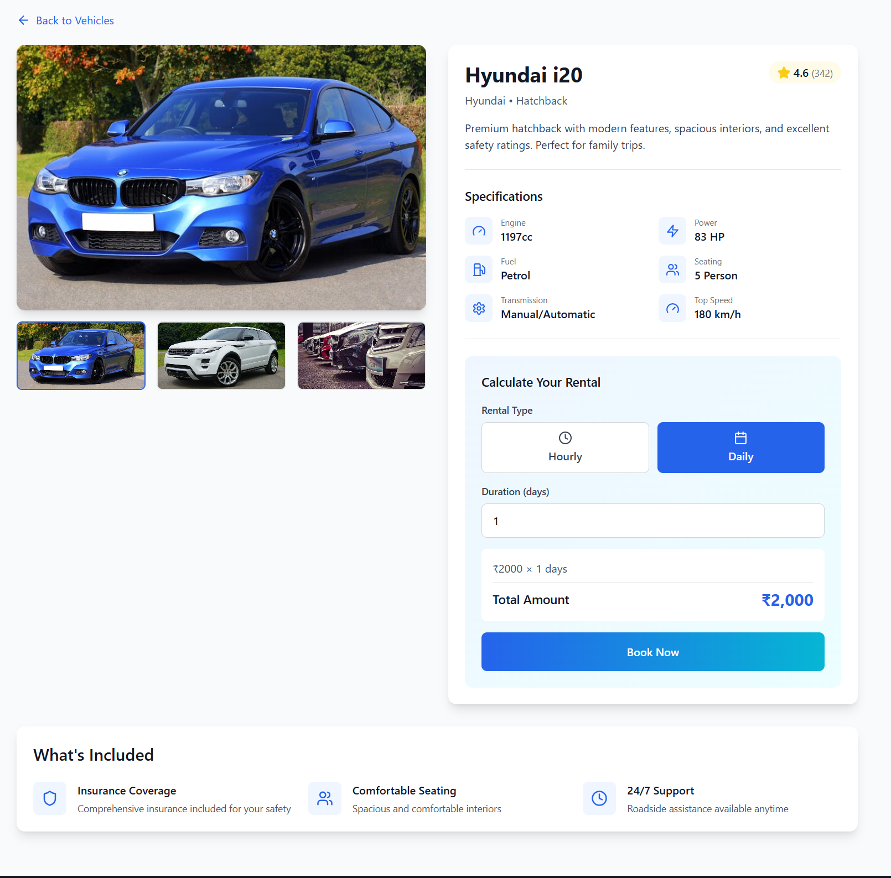
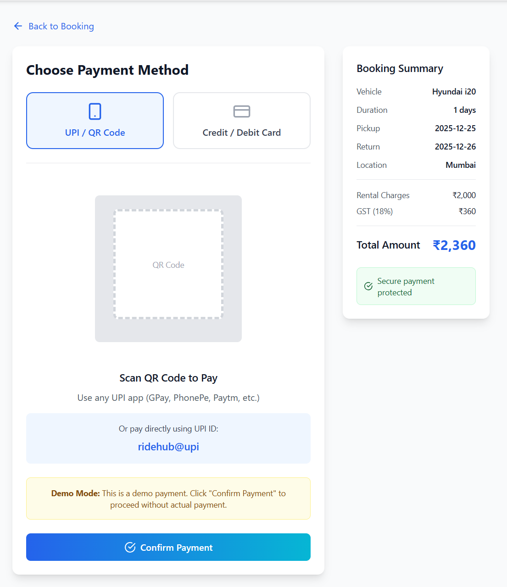
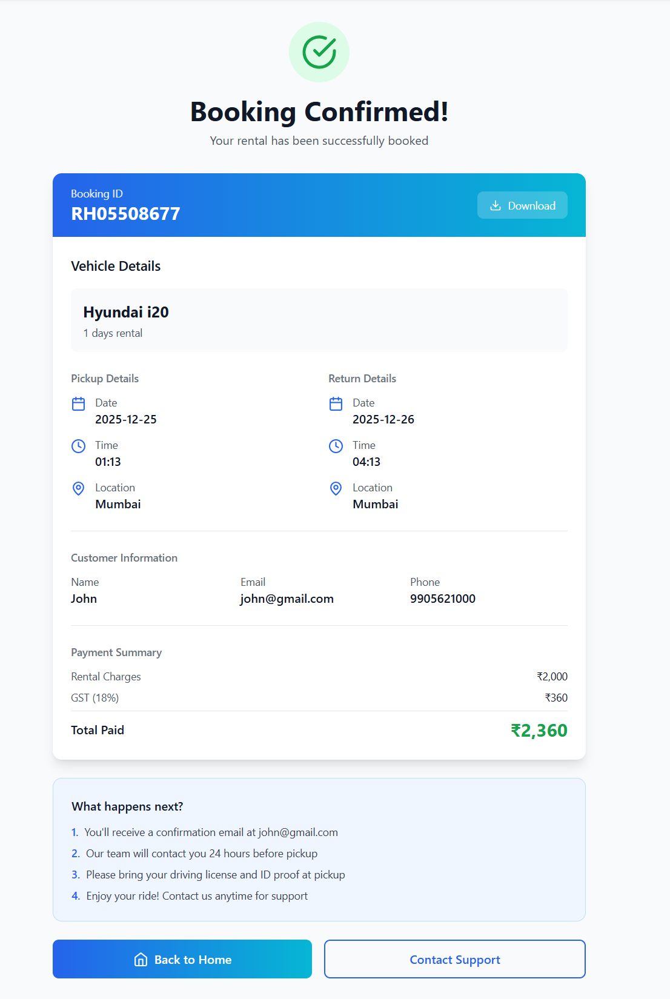

# Vehicle Rental Booking Platform

A modern and responsive vehicle rental platform that allows users to browse,
select, and book cars and bikes based on availability, rental duration, and
pricing. The application demonstrates a complete booking flow using mock data
and is designed to be backend-ready for real-world integration.

---

## 🚗 Features
- Car and bike rental listings
- Date-based booking and availability selection
- Rental duration and pricing calculation
- Booking summary and confirmation flow
- Responsive UI for mobile, tablet, and desktop
- Clean and intuitive user experience

---

## 🛠 Tech Stack
- Frontend: React + TypeScript
- Styling: Tailwind CSS
- Build Tool: Vite
- Version Control: Git & GitHub

---

## 🧠 Data & Architecture Notes
- Uses mock data to simulate vehicle availability, bookings, and pricing logic
- Designed to be easily extendable with a real database and payment gateway
- Booking flow structured to reflect real-world rental platforms

---
## 📸 Screenshots

### Home Page


### Class Booking


### Checkout


### Payment Success



## 🌐 Live Demo
🔗 https://vehicle-rental-booking-platform.vercel.app/


---

## 📂 Project Setup (Run Locally)

```bash
git clone https://github.com/ady254/vehicle-rental-booking-platform.git
cd vehicle-rental-booking-platform
npm install
npm run dev
